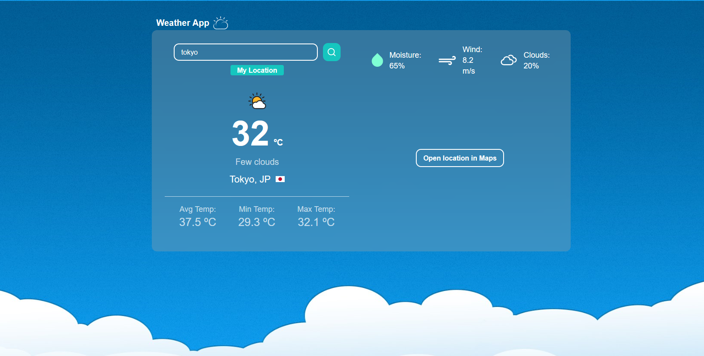

It's been more than a year since I've started working with typescript and the Node ecosystem, and throughout I have not written a single line of frontend code, Which I think is strange for some folks since I get asked about most things related to frontend, and they are surprised when I say I don't know **ReAcT**.

So I decided to change that and take a look at the frontend world. To be honest, I'm not particularly interested in frontend and cosmetic stuff, but I do genuinely appreciate a good user experience and the thought process and craftsmanship that goes into making one. And what's a better way to understand something than to get your hands dirty with it?


TBH, I used to think that web front-end can't be that much work since everything is baked into the browsers; you just add some structure and styling here and there, don't have to think about logic and stuff... And _spoiler alert: boy, I was wrong..._


## What are we building?

So I did some research, and to no one's surprise, the most used(over) and popular option for the web is no doubt **React**. And for the project I was planning and started building a simple ChatGPT-like chat app that calls OpenAI's api for generation, but failed miserably as I was not able to remotely make it as I liked and was spending too much time to get everything look as I wanted with the shittiest CSS knowledge I have, so I gave up, and after looking a bit more, I found that **_movie rating_** and **_weather app_** are kind of like hello-world of the frontend, so with my lowered expectations and someone's left-over design code, I started building a weather app.



At the same time, I wanted to try the latest and greatest things that are currently available. Though the most popular solutions seem to be **Next** and **Vercel**, I like vercel's service, but in my opinion, they're way too overrated, and some of the other services are far superior to them. My personal favourite is [**Cloudflare Pages**](https://pages.dev). In my opinion, Cloudflare has some of the best solutions for most things related to the web.

At the end, I decided to build a simple single-page weather app using react as a framework with weather data from [openweathermap](https://openweathermap.org/), and to proxy api calls to openweathermap I decided to try [**cloudflare-pages function**](https://developers.cloudflare.com/pages/platform/functions/) which is powered by [**cloudflare workers**](https://workers.cloudflare.com/). And to make things more interesting, I decided to use [**hono**](https://hono.dev) framework for cloudflare workers. I like edge computing and serverless stuff some is sometimes overused but mostly convenient.

### Final Stack

- [**React**](https://reactjs.org/) - Frontend Framework
- [**Cloudflare Pages**](https://pages.dev) - Hosting
- [**Cloudflare Workers/function**](https://developers.cloudflare.com/pages/platform/functions/) - Serverless Functions (used for proxying api calls)
- [**Hono**](https://hono.dev) - A small, simple, and ultrafast web framework for the Edges.
- [**OpenWeatherMap**](https://openweathermap.org/) - Weather Data API

### The Process

I'm not going to go over every step of the process like some tutorial, but I'll try to go over my general feelings about the process and the experience I had with it.

#### React

From my experiences, I know some of the common things about the build process, how things are built and bundled, what code ships to the browser, and stuff. So it's easy(er) for me to pick vite and typescript; for jsx(tsx) part, it's not that bad, but everything else was foreign to me. Initially, I tried to do everything from scratch—CSS and everything—but later realized it wasn't for me, so I decided to use some pre-made design and CSS code, use it as a base, and start building on top of it.

At first everything was a piece of cake, but when I started referencing other bigger projects and codebases, it kind of made me overturn a little. I've just scratched the surface of React and haven't even touched some of the concepts like routing, complex state management, and other stuff, but I think it gave me a broader perspective for a change.

#### Cloudflare Pages

Great service, great support, never had major issues with it, loves the simplicity and speed of it.

#### Cloudflare function


Not to be confused with cloudflare workers(though they are powered by workers), the cloudflare function is part of the cloudflare pages platform, for building full-stack(ish) apps.


Cloudflare Pages, on the other hand, is a bit of a different story. I have worked with cloudflare workers countless times, and I linked their web-standard api and have good docs with good enough dev experience with Wrangler cli.

But not everything that applies to workers is the same for the cloudflare pages function, the most notable difference is the way you run the code locally. For workers, I use wrangler with a toml file and just use `wrangler dev` to run, and everything works as expected, but for the function, you have to use `wrangler pages` command which was introduced in v2, but after some trial and error, I managed to get it working. I like the feature that you just set up routes based on the directory structure, and you can write directly in Typescript without needing to set up a build process or anything.

#### Hono

[Hono](https://hono.dev) is a small, simple, and ultrafast web framework for the Edges. It works on any JavaScript runtime: Cloudflare Workers, Fastly Compute@Edge, Deno, Bun, Vercel, Netlify, Lagon, AWS Lambda, Lambda@Edge, and Node.js.



I used it as just a simple router for my proxy function and used their client for type inference on the frontend.

I think it has a lot of potential going forward as a minimalistic framework for edge. I had tiny issues with it here and there and don't like its current state of type-system, though it's currently under development. I'm not going to complain about it. Looking forward to seeing how it evolves.

#### OpenWeatherMap

The most popular weather api out there, I think it's good enough for my use case, and I don't have any complaints about it as it provides a free tier with 1000req/day. I went ahead a step and used a simple caching mechanism for the api calls, using cloudflare [KV](https://developers.cloudflare.com/workers/runtime-apis/kv/) don't think it's the best solution for the purpose, but some caching is better than no caching. Initially, I wanted to use [upstash](https://upstash.com/) but didn't want to add another dependency on other services.

#### Result



- If I were to start over and do the same for production, I would set up a monorepo for the function and hono related code.
- I would use a more robust caching mechanism like redis or memcached.
- I would set up a more streamline build process for production and development.
- For actual team projects, I would use a better alternative like [Remix](https://remix.run) which has more streamline support for edge environments like cloudflare workers.



## Conclusion



I hate being asked this kind of question, like **r u a xyz-developer...?**. Well **No, I'm just a software engineer** and that's all I want to be. Well, I get that at some point and level you do need a greater understanding of some specific thing, and I also get that things like _react, node,.net etc..._ are not diminutive or trivial projects or technologies; they're massive, and for a reason why people associate themselves with those the way they do...

But, at the end, I just don't like self-presenting as some kind of **_frame-worker_**, **_language-ist_** or **_xyz-ist_** all I enjoy is solving problems, and even more so the intricacies of solving them...


Overall, this was a fun little experiment to broaden my perspective and understanding of the things that I had neglected for a long time, and I would like to explore more things in the future, not only other frameworks (keeping an eye on _svelte_, _astro_, _angular_) or just the web (would like to explore embedded and IOT), but also anything that interests me.


