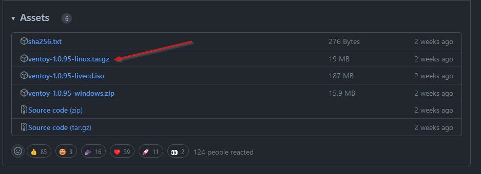
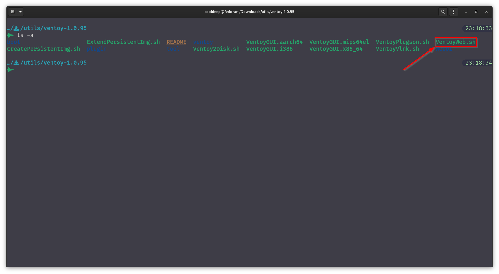
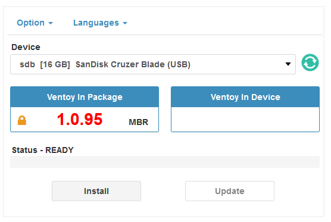
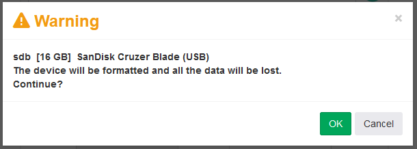
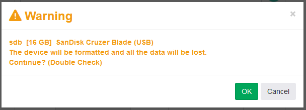
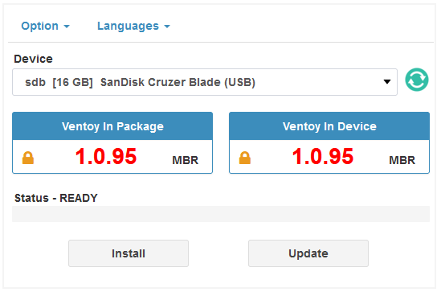
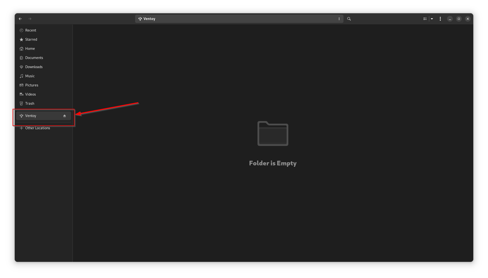
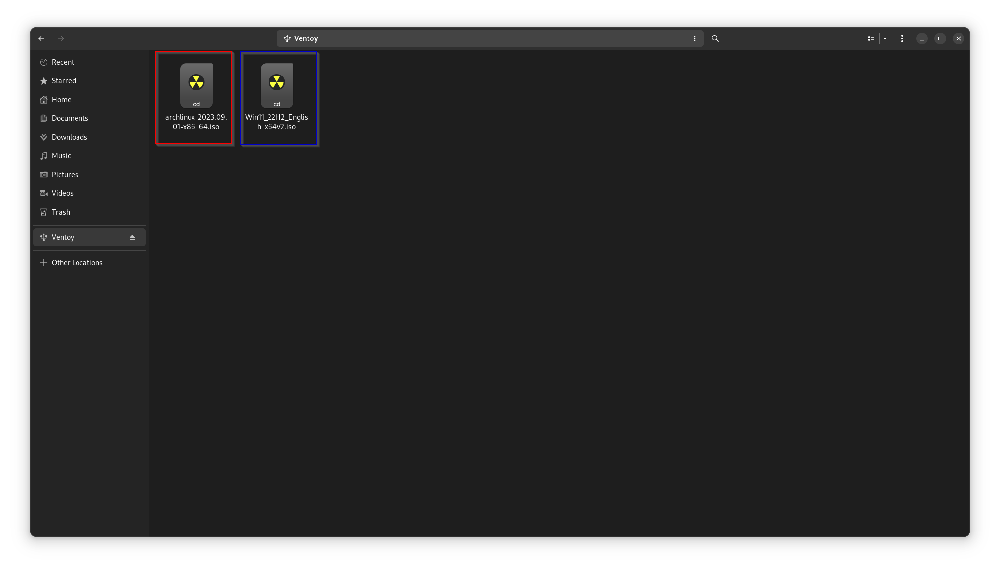
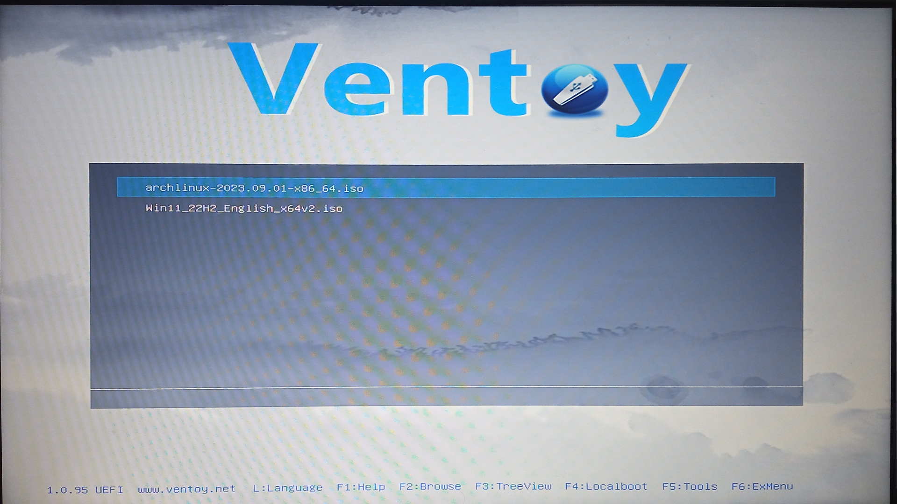
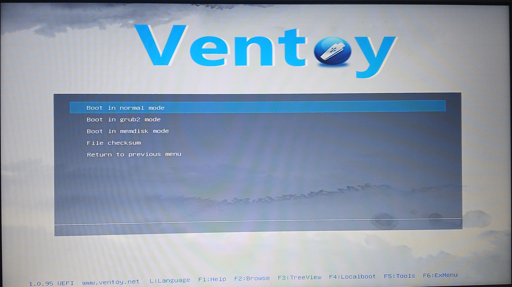

I distro-hop quite a lot, sometimes to check out the new features of a distro and get a little feel for it, other times just to check the compatibility of different pieces of software. For these reasons, I might stay with a distribution for a long period of time or just for a few things here and there, but no matter the reason, I need to create a bootable media from the respected ISO files and burn them to a USB and so on, and I have to do it every time I want to change the distro for some reason I need a bootable media.

Up until now, I have been just using the `dd` command to create a bootable drive, or for Windows, my go-to choice has been [rufus](https://rufus.ie/). Both of these methods get the job done, but it's quite repetitive, and no matter how small the installation ISOs are, once I burn them to a drive, I can't use the drive for anything other than as boot media. A project called ventoy addresses all these issues with its unique approach to creating and using bootable media.

## What is Ventoy?

[Ventoy](https://www.ventoy.net) is an open-source tool to create bootable USB drives for *ISO/WIM/IMG/VHD(x)/EFI* files. With ventoy, you don't need to format the disk over and over; you just need to copy the *ISO/WIM/IMG/VHD(x)/EFI* files to the USB drive and boot them directly. You can copy many files at a time, and ventoy will give you a boot menu to select them.

It supports BIOS and UEFI, has support for over **1100+** image files, and supports over **90%+** of distros on [distrowatch.com](https://distrowatch.com) including all versions of Windows. I personally never had any compatibility issues with it, but ventoy maintains a [compatibility list](https://www.ventoy.net/en/isolist.html) on their site that is tested and certain to work.

To put it in simple terms, Ventoy divides a USB's storage block into two partitions: one for boot that has all the necessary stuff for booting off of it, and another for storing all the bootable images that you can use as regular storage as well. All we have to do is just copy-paste whatever image media is on the other partition, and we can select it at the boot screen of ventoy.

It has really straight-forward guides for installing ventoy as a driver, both for Windows and Linux. For Windows, it has an excellent wizard to just select a USB and create bootable media out of it. In short, I'll go over a simple way to install it on a Linux machine.

## Installation

### Download

To download it, head over to their GitHub [releases page](https://github.com/ventoy/Ventoy/releases) and download the latest version's compressed file for Linux.


Extract the downloaded file with:

```bash
 tar -xvf <downloaded-file>.tar.gz
```

### Using Ventoy WebUI

- Now go to the extracted folder and locate `VentoyWeb.sh` we're going to use this to run the Ventoy webUI, which is, in my opinion, the best way to get ventoy running on a USB drive...


- Now plug in the USB drive you want to use as a bootable drive.

- Run the following command to run ventoy webUI locally

```bash
sudo ./VentoyWeb.sh -p 8080 -H 0.0.0.0
## you should see
# ===============================================================
#   Ventoy Server 1.0.95 is running ...
#   Please open your browser and visit http://0.0.0.0:8080
# ===============================================================
```

- Open a web browser and go to `http://127.0.0.1:8080` you should have a web page like this with all your connected USB drives listed.


- Select the driver you want to use from the drop-down menu and click "Install" on the page.
  - > If you don't see your device listed, try plugging it in and refresh the page. If you still have the problem, select the list all devices from the options menu and refresh...
  - On clicking install, you should follow the warning messages, read them carefully, and proceed if everything seems correct.
 


Click on **install** it'll erase all the data on the selected drive, ***make sure the selected device is the correct one...***


- After a successful operation, you should see `Ventoy In Device` showing the latest version number that we have downloaded. At this point, you can close the running http server that we started by running the commands using `ctrl+c`...



You can clear your USB with the same process by selecting `Clear Ventoy` from the options' menu. **That process will also clear your data and all the other things that you may have stored on a regular partition.**


- And that's all you have to do as far as installing Ventoy on a USB media, on successful installation, you should see a volume mounted as `Ventoy` in your file manager.



Don't change the name of the drive or format it with a different file system; it'll corrupt the ventoy binding.


### Using Ventoy

Using ventoy is as easy as copying and pasting the whatever OS ISO you want into the ventoy volume mount. You can store multiple ISO files, and even utilize this mount as regular storage. When we boot from this disk, we'll have a selection menu of all the ISOs we pasted, and we can select from which to boot into that ISO without burning it. E.g.::

- We will download Arch Linux and Windows 11 IOS and put both of them in the ventoy mount at root.


- After which, we'll boot from the USB from our boot menu by selecting our USB drive, and we'll see a menu something like this:


- In this menu, we'll have a list of all the ISO files we have in the ventoy mount. We can select any of them and boot into them; in this case, we'll select Arch Linux and press enter.


- And will have some options for boot. Select the first option `Boot in normal mode` and press enter...

- And that's it. We'll boot into the Arch Linux ISO; we can do the same for the Windows 11 ISO, as well as any other ISO we want to boot into...


If you have a UEFI security error while booting through Ventoy USB, then from the Administer Secure Boot menu, try enrolling the cert in the UEFI security for trusted execution. Or you can just disable secure boot from the BIOS for quick access.


## Conclusion

Overall, Ventoy is one of the best ease-of-life utility I use. If you need to create bootable media quite frequently or just want to have bootable media for your system, ventoy is a great choice.


