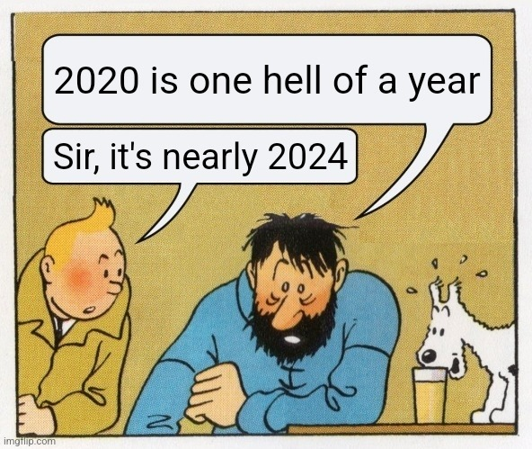

# The journey continues

I just want this post to be a short documentation of my current thoughts and perspectives as we rush towards 2024. As I'm writing this, 2024 is just a few hours away. Can't believe that it's been four years since 2020 feels like yesterday and the fact that the year 2040 is nearer than the year 2000 the year of my birth.

Don't know what to think about these past few years, feels like too many things have changed and much going on, but at the same time does not feel like much happened at all.

Looking back at 2023 perhaps the most significant thing was definitely **Generative Ai**s, We are the first generation to experience from my perspective a new revolution. I think we might be at the same level as the people of the early 90s who were experiencing the internet for the first time.

I don't know how significant this all is going to be, but I'm now sure that the world is moving faster and faster than ever before. I feel like all these years I was trying to keep up the pace and play catch up. Doing all that, I can't help self but feel like I'm an underachiever, yet I am not sure what I am comparing myself against.

This year, I was fortunate enough to get to work and know some of the most competent and amazing people I've ever met. To be honest, I've never felt more envious in my entire life, yet I come to cherish them. I come to learn one thing for sure, I need to overcome my conventional thinking of consumerism and focus on the creative and creational side of things.

I think I'm ready to stop playing catch-ups and start focusing on my own games and really excel at them. And go deep into things and go out of my comfort zone. I think I like to take that as my New Year's resolution.

I hope we all have a truly great years ahead of us.

