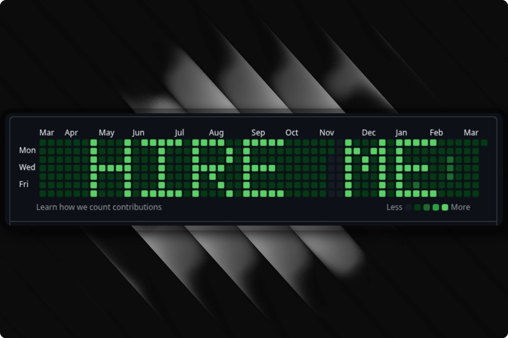

GitHub's contribution graph is a 53×7 grid of green squares—one for each day of the year, shaded by how many commits you made. Most people ignore it. Commit Canvas turns it into a display board: type a message, and the tool generates the exact pattern of backdated commits needed to spell it out on your profile.

The idea is simple, but the execution touches a few interesting problems. The contribution graph isn't a pixel grid you can write to directly—it's a reflection of your git history. So the tool needs to map characters onto calendar dates, figure out how many commits each "pixel" needs to stand out against your existing activity, and then create those commits as fast as possible.

### Font rendering on a calendar

Each character is defined as a 5×7 bitmap—just enough resolution to be legible on the graph's tiny squares. The renderer lays these bitmaps onto a 53-column × 7-row grid aligned to the contribution calendar (weeks run left to right, days top to bottom, starting on Sunday). Messages can be left-, center-, or right-aligned within the available space.

The tricky part is date mapping. GitHub's default view shows a rolling window of roughly the last 364 days, aligned to week boundaries. The tool calculates the exact Sunday that starts the visible window and maps each grid cell to its corresponding calendar date. For fixed-year views (e.g., 2025), the mapping shifts accordingly.

### Calibration

Generating a flat number of commits per active cell doesn't work well in practice—if you're an active developer, your existing contributions drown out the message. If you're not active, even a few commits per day create harsh contrast.

The tool solves this by optionally scraping your public contribution data from GitHub and using percentile-based calibration. It collects all non-zero contribution days, sorts them, and picks thresholds based on P75 and P90 values:

- **High contrast**: P90 × 2 + 1 commits per active cell
- **Medium**: P75 × 2 + 1
- **Low**: P75 + 1

Everything is capped at 50 commits per day to avoid absurd commit counts. Without a username, sensible defaults kick in.

### Fast commit generation

The naive approach—`git add` + `git commit` per commit—is painfully slow when you need hundreds of commits. Even `--allow-empty` (skipping file writes) only gets you so far.

Commit Canvas drops down to git plumbing commands. It creates a single empty tree with `git mktree`, then chains commits using `git commit-tree -p <parent>`, and finally points the branch at the last commit with a single `git update-ref`. This avoids the index entirely and runs roughly 15–20× faster than the porcelain approach—around 600 commits per second on modest hardware.

### Interactive mode

Beyond the CLI flags, there's a full terminal UI built with Bubble Tea that walks through each step: message, author info, optional GitHub username, year, alignment, and a live ASCII preview. If you provide a username, it fetches your contribution data in the background and overlays your message on top, so you can see exactly how it'll look before committing.

---

[View the repository][repo-link]

[repo-link]: https://github.com/coldter/commit-canvas
