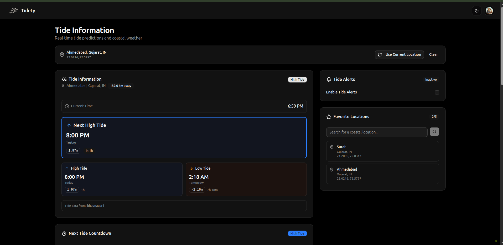
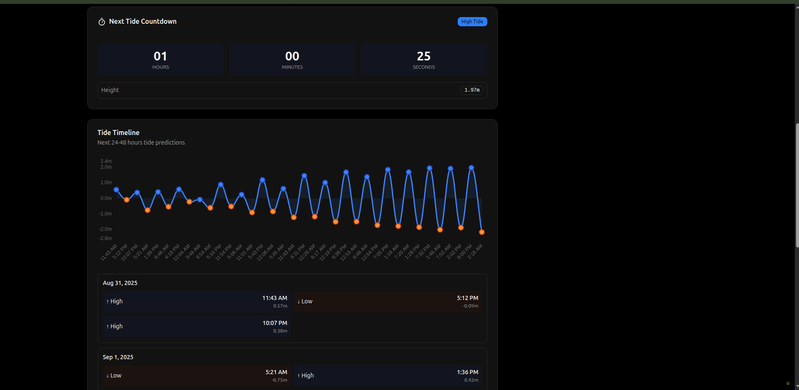
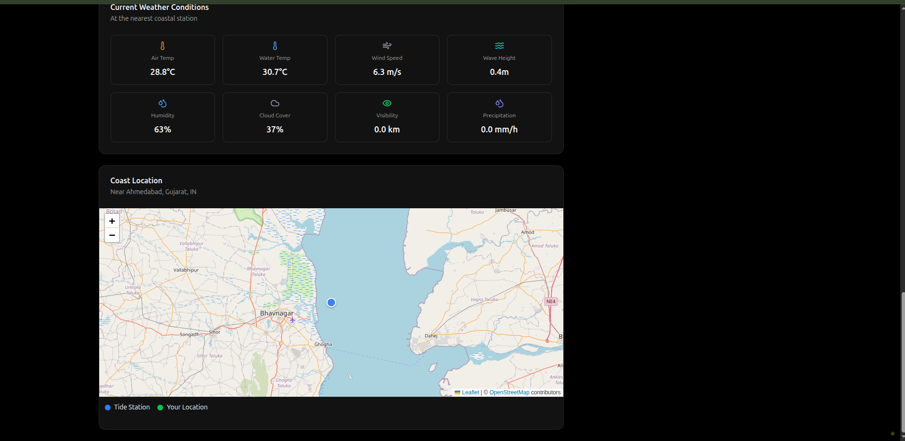

Coastal conditions change quickly, and for anyone planning time on the water—whether for work, recreation, or travel—timing matters. Tide Info is a tide tracking application designed to make that planning easier by combining tide predictions, local weather context, and simple alerts into a single interface.

From a build perspective, the project is heavily TypeScript-driven, which makes it easier to keep API responses, UI state, and forecast calculations aligned as features expand. Tide and weather data are typically consumed from external services (often with different schemas and update cadences), so the app benefits from typed “data shapes” (interfaces/types) and small normalization steps—turning raw API payloads into a consistent internal format that UI components can rely on.

The UI is structured around a few core ideas:

- **Forecast-first views**: present “now” plus the next major events (e.g., next high/low) with clear timestamps.
- **Location-centric state**: a selected coastal location drives which tide series and weather snapshot are loaded, cached, and displayed.
- **Alert-friendly data model**: rather than only rendering charts, the app also elevates _events_ (threshold crossings, approaching extremes, notable shifts) that can be used to trigger smart notifications.

Because responsiveness matters (many users check tides on mobile at the shoreline), the styling layer stays lean, with a small CSS footprint supporting fast rendering and simple layout adjustments across screen sizes. Overall, the project balances a clean, user-oriented surface with just enough structure underneath—typed data models, predictable state flow, and reusable UI building blocks—to keep real-time environmental data understandable and dependable.

---

[View the repository][repo-link]

[repo-link]: https://github.com/coldter/tide-info
