Vync is a hobby project, built primarily as a learning exercise in native app development, device pairing, and the logistics of orchestrating a fleet of displays from a single controller. The current build targets Android TV, but the architecture is designed to extend to native clients on Windows, macOS, and Linux—each contributing its own native capabilities (system wallpaper, multi-monitor layouts, window management) to what a "display" can mean. Longer term, the same controller could drive scheduled workflows across a mixed set of screens: a morning dashboard on one, a rotating gallery on another, all coordinated from one app.

Vync turns any Android TV into a display you can drive from your phone. The phone app authenticates a user, pairs one or more TVs, and pushes images, videos, text slides, and slideshows to them—individually or as synchronized groups. The TVs themselves never sign in; they carry a device token issued during pairing and otherwise just react to server state.

The interesting parts live in the orchestration layer. Convex acts as a reactive backbone: every TV subscribes to a `getDesiredState` query and acknowledges transitions, so the state machine (`unpaired → pairing → idle ↔ playback`) is driven from the server rather than by imperative commands from the phone. No polling, no websocket plumbing of our own.

### Pairing without accounts

TVs enter pairing mode and display a 6-digit OTP alongside a QR code. The phone claims the session via `pairing.claim`, the server issues a device token, and from that point the TV is addressable by its owner. Unpairing revokes the token and resets the device back to `unpaired`.

### Direct-to-R2 uploads

Media never passes through backend functions. The phone calls `media.preflight`, receives a presigned Cloudflare R2 URL, uploads directly from the device, and then calls `media.confirmUpload` to register the asset. A reference-counting pass in the backend handles deletes, so the same blob can back multiple library entries without duplicating storage.

### Synchronized group playback

Starting a group session isn't a broadcast—it's a readiness barrier. `playback.startGroupPlayback` creates the session in a `preparing` state; each member preloads and acks `ready`; the server flips to `playing` once everyone is in, `degraded` if only some arrive, or `failed` if none do. Local start times are computed from a server `startAt` plus each device's clock offset (captured via `heartbeat.report`), so playback lines up within a frame or two across screens. Video sessions refuse late rejoins to avoid desync—recovery requires an explicit `playback.retry`.

Built as a Bun + Turborepo monorepo: TanStack Start web app, an Expo phone controller, an Expo Android TV player, and a shared Convex backend. Two-tier heartbeats (fast for presence, slow for metrics) power offline detection, and cron jobs sweep stale pairings, sessions, and locks on a schedule.

### What's next: multi-platform sync

The Android TV player is the first target; the same pairing + state-machine model should generalize to a handful of native clients:

- **Windows, macOS, Linux** — lightweight native clients that register the same way TVs do. Instead of running a fullscreen player, they hook into the OS: programmatic wallpaper rotation on Windows (`SystemParametersInfo`) and macOS (`NSWorkspace.setDesktopImageURL`), overlay windows for ambient content, per-monitor assignment on multi-head setups.
- **Creative multi-display setups** — treat each client's native surface as a first-class capability. A laptop might receive "wallpaper content" while a connected TV in the same group receives a slideshow; the controller sees them as one group, the server dispatches the right payload per capability.
- **Scheduled workflows** — time-based playlists that shift content by hour or day. A "morning dashboard → midday calm → evening cinema" schedule runs entirely from the backend, so displays don't need the phone online to follow the plan.
- **Richer sync primitives** — extending the readiness-barrier model beyond video to wallpaper transitions, slideshow advances, and cross-device effects that depend on all screens flipping at the same wall-clock instant.

The goal isn't a product so much as an experiment in treating heterogeneous screens as a single orchestrated fleet.

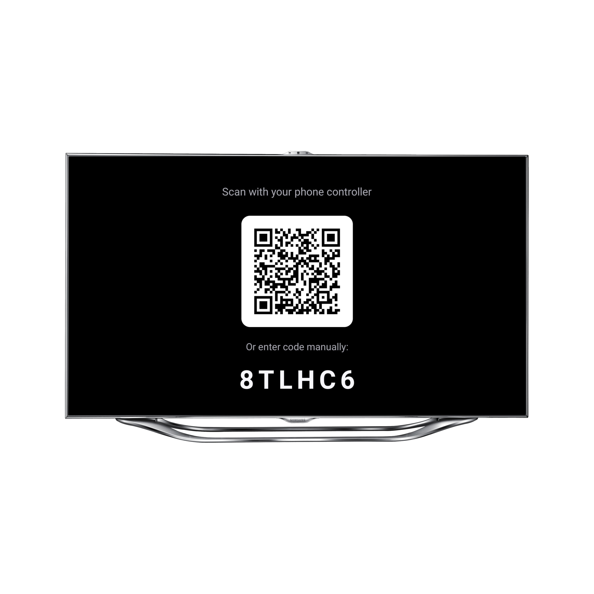

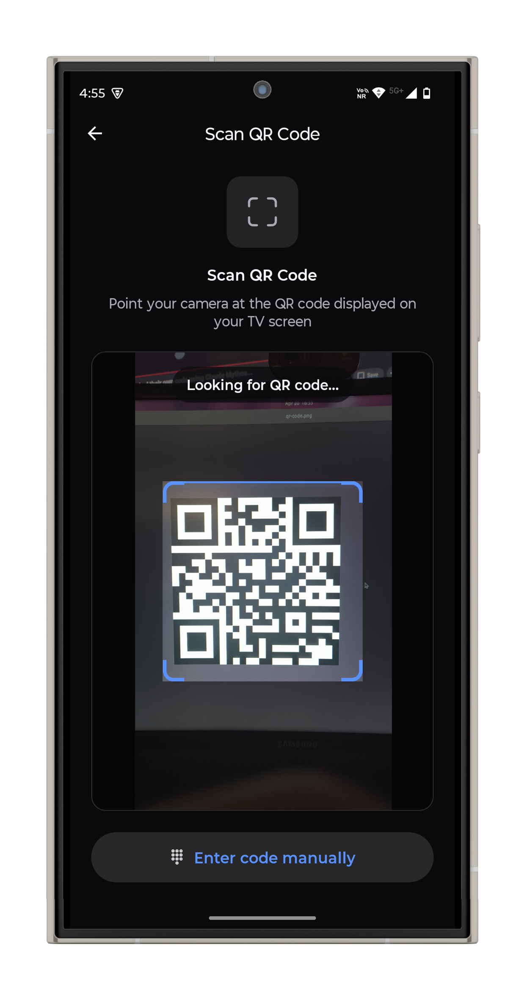

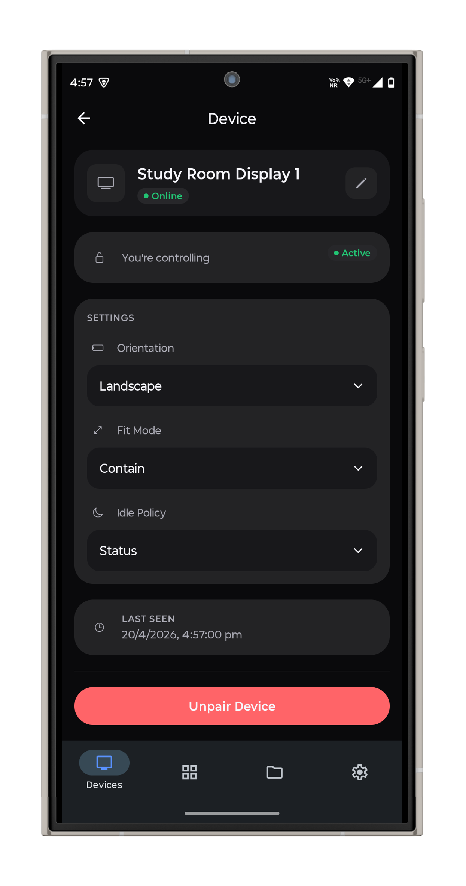

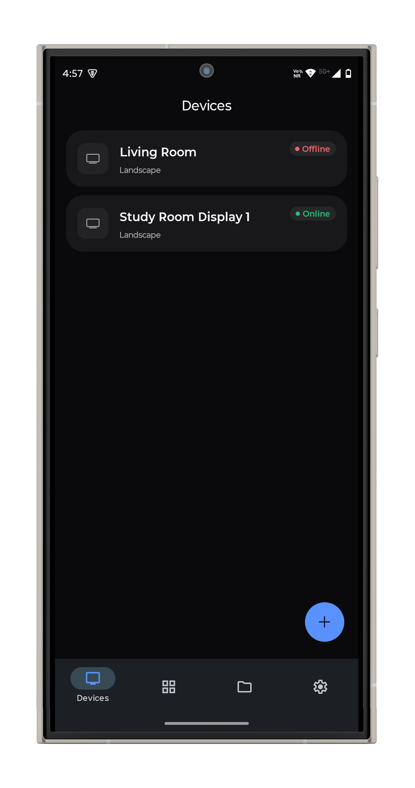

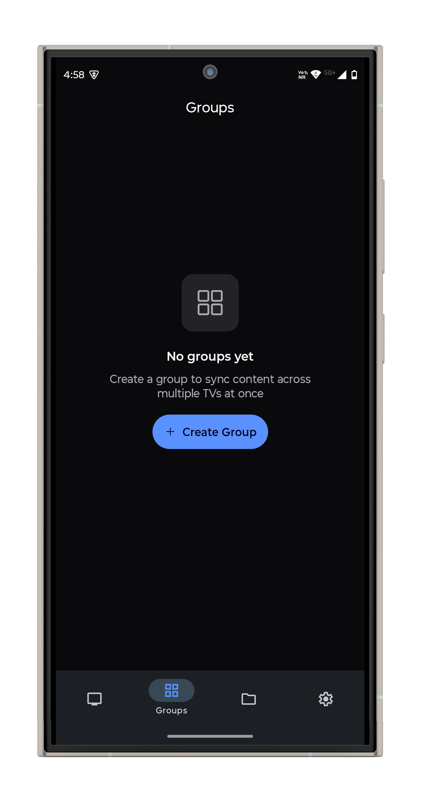

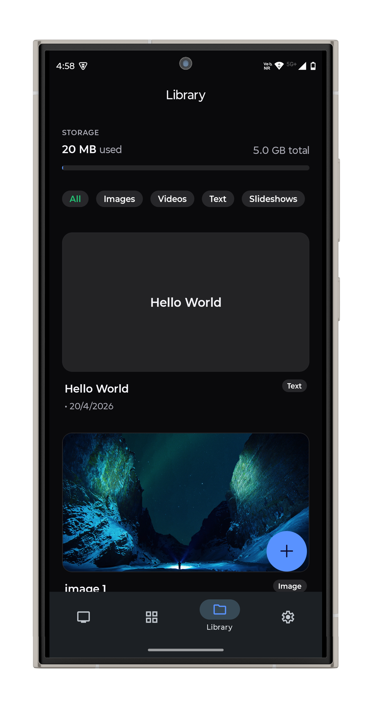

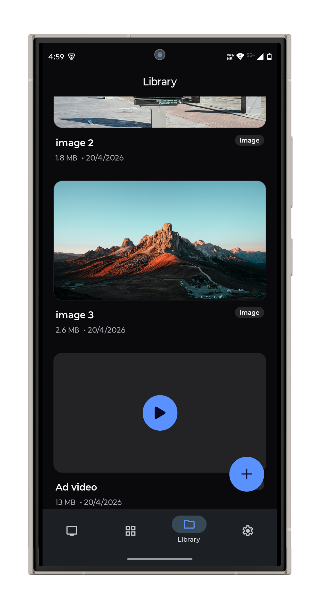

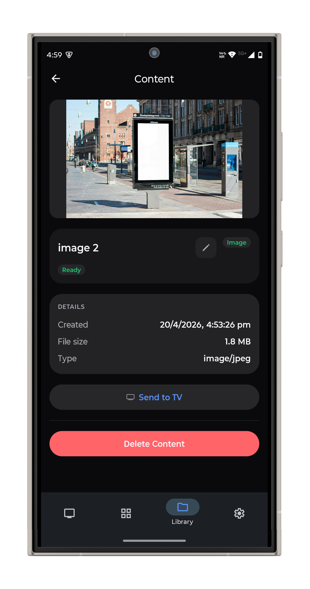

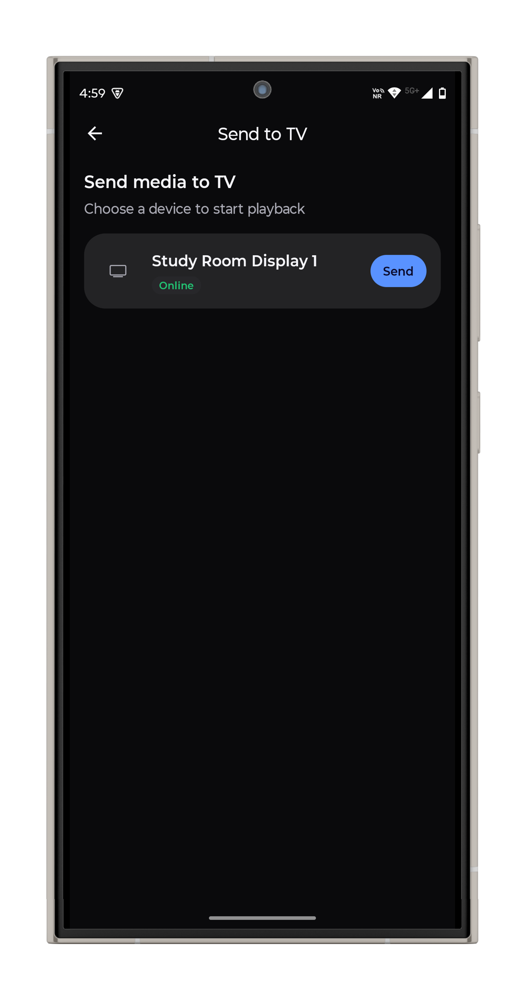

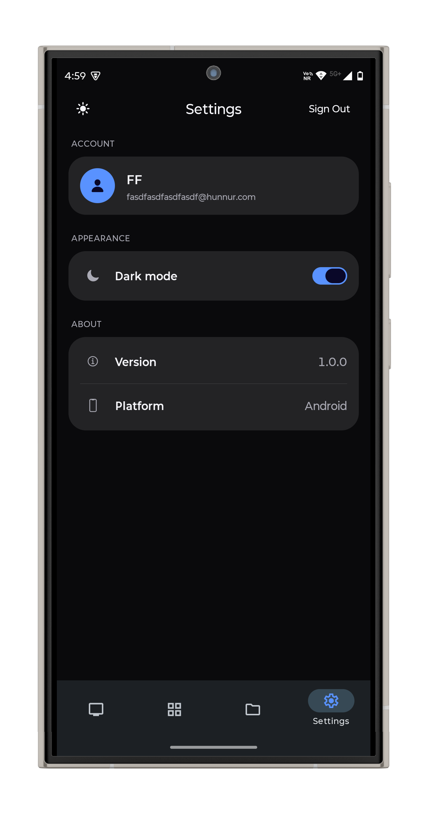

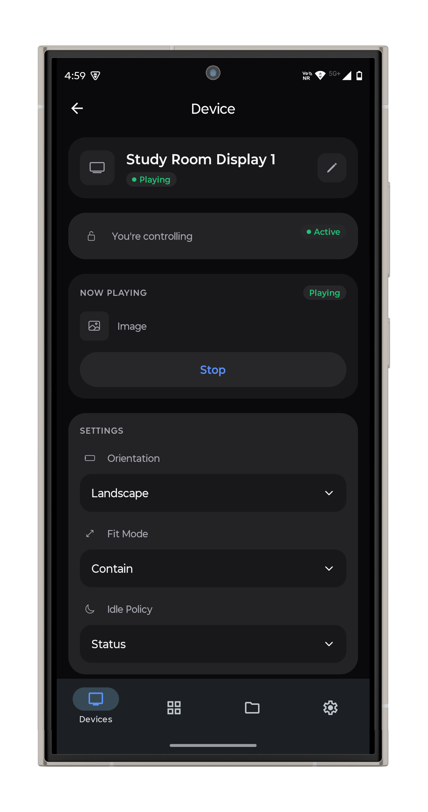

---

